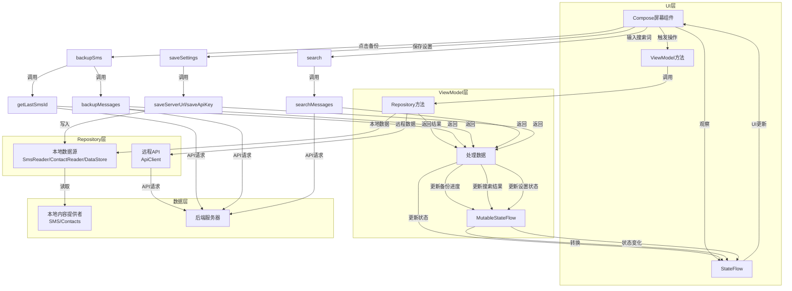
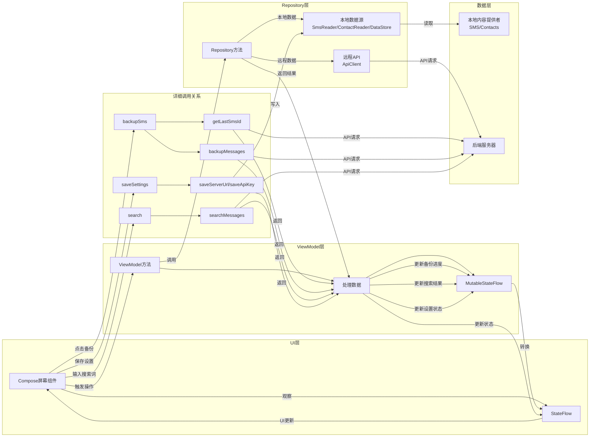

# Beautiful Mermaid

## 功能介绍

此技能使用 [beautiful-mermaid](https://github.com/lukilabs/beautiful-mermaid) 库来美化和渲染mermaid流程图，提供以下功能：

- 美化mermaid图的外观，使其更加专业美观
- 支持多种内置主题切换（GitHub Dark、Tokyo Night、Catppuccin Mocha等）
- 提供响应式设计，适配不同屏幕尺寸
- 保持流程图的逻辑结构和功能完整性

## 使用场景

当用户：
- 反馈mermaid图线条太乱，需要更规整的布局
- 希望美化现有mermaid图的外观
- 要求使用beautiful-mermaid库渲染图表
- 需要创建更加专业的流程图

## 使用步骤

### 步骤1：准备mermaid图代码

从现有文件中提取mermaid图代码，或准备新的mermaid图代码。

### 步骤2：创建美化版HTML文件

创建一个HTML文件，引入beautiful-mermaid库并配置主题。

### 步骤3：渲染和预览

启动本地服务器并在浏览器中预览美化后的图表。

## 示例代码

### 基本HTML模板

```html
<!DOCTYPE html>
<html>
<head>
    <meta charset="utf-8">
    <title>美化版 Mermaid 图</title>
    <style>
        body {
            font-family: Arial, sans-serif;
            margin: 20px;
            background-color: #f5f5f5;
        }
        .container {
            max-width: 1200px;
            margin: 0 auto;
            background-color: white;
            padding: 30px;
            border-radius: 8px;
            box-shadow: 0 2px 4px rgba(0,0,0,0.1);
        }
        h1 {
            color: #333;
            text-align: center;
            margin-bottom: 30px;
        }
        #diagram {
            width: 100%;
            height: auto;
            margin: 20px 0;
        }
        .theme-selector {
            margin: 20px 0;
            text-align: center;
        }
        .theme-btn {
            padding: 8px 16px;
            margin: 0 5px;
            border: 1px solid #ddd;
            border-radius: 4px;
            background-color: #f0f0f0;
            cursor: pointer;
        }
        .theme-btn:hover {
            background-color: #e0e0e0;
        }
        .theme-btn.active {
            background-color: #4CAF50;
            color: white;
            border-color: #4CAF50;
        }
    </style>
</head>
<body>
    <div class="container">
        <h1>美化版 Mermaid 图</h1>
        
        <div class="theme-selector">
            <button class="theme-btn active" data-theme="github-dark">GitHub Dark</button>
            <button class="theme-btn" data-theme="tokyo-night">Tokyo Night</button>
            <button class="theme-btn" data-theme="catppuccin-mocha">Catppuccin Mocha</button>
            <button class="theme-btn" data-theme="nord">Nord</button>
            <button class="theme-btn" data-theme="dracula">Dracula</button>
        </div>
        
        <div id="diagram"></div>
    </div>
    
    <script src="https://unpkg.com/beautiful-mermaid/dist/beautiful-mermaid.browser.global.js"></script>
    <script>
        const { renderMermaid, THEMES } = beautifulMermaid;
        
        const diagramCode = `
            // 在这里粘贴你的mermaid图代码
        `;
        
        let currentTheme = 'github-dark';
        
        async function renderDiagram(theme) {
            const diagramElement = document.getElementById('diagram');
            try {
                const svg = await renderMermaid(diagramCode, THEMES[theme]);
                diagramElement.innerHTML = svg;
                
                // 更新按钮状态
                document.querySelectorAll('.theme-btn').forEach(btn => {
                    if (btn.dataset.theme === theme) {
                        btn.classList.add('active');
                    } else {
                        btn.classList.remove('active');
                    }
                });
                
                currentTheme = theme;
            } catch (error) {
                console.error('渲染失败:', error);
                diagramElement.innerHTML = '<p>渲染失败，请检查控制台错误</p>';
            }
        }
        
        // 初始渲染
        renderDiagram(currentTheme);
        
        // 主题切换
        document.querySelectorAll('.theme-btn').forEach(btn => {
            btn.addEventListener('click', () => {
                renderDiagram(btn.dataset.theme);
            });
        });
    </script>
</body>
</html>
```

### 启动本地服务器

```bash
python3 -m http.server 8000
```

然后在浏览器中访问：`http://localhost:8000/beautiful_mermaid.html`

## 布局优化技巧

当mermaid图线条太乱时，可以使用以下技巧优化布局：

1. **调整图表方向**：使用 `flowchart LR`（从左到右）而不是 `flowchart TD`（从上到下）

2. **组织子图**：将相关组件放在同一个子图中，使用 `subgraph` 命令

3. **调整子图方向**：在子图内部使用 `direction TB` 保持垂直布局

4. **分离详细调用**：将具体方法调用放在单独的子图中，减少主流程的线条复杂度

5. **优化连接顺序**：合理安排组件的连接顺序，减少线条交叉

## 示例：优化UI、ViewModel、StateFlow、Repository关系图

### 优化前



### 优化后



## 支持的主题

beautiful-mermaid 库支持以下内置主题：

- github-dark（默认）
- tokyo-night
- catppuccin-mocha
- nord
- dracula
- zinc-light
- zinc-dark
- tokyo-night-storm
- tokyo-night-light
- catppuccin-latte
- nord-light
- solarized-light
- solarized-dark
- one-dark

## 注意事项

1. 确保网络连接正常，以便加载beautiful-mermaid库
2. 对于复杂的图表，可能需要调整浏览器窗口大小以获得最佳显示效果
3. 如果图表渲染失败，请检查控制台错误信息
4. 对于特别大的图表，可能需要增加浏览器的内存限制

## 结论

使用beautiful-mermaid库可以显著提升mermaid图的视觉效果，使其更加专业美观。结合布局优化技巧，可以创建出既清晰又漂亮的流程图，有效传达系统架构和组件关系。